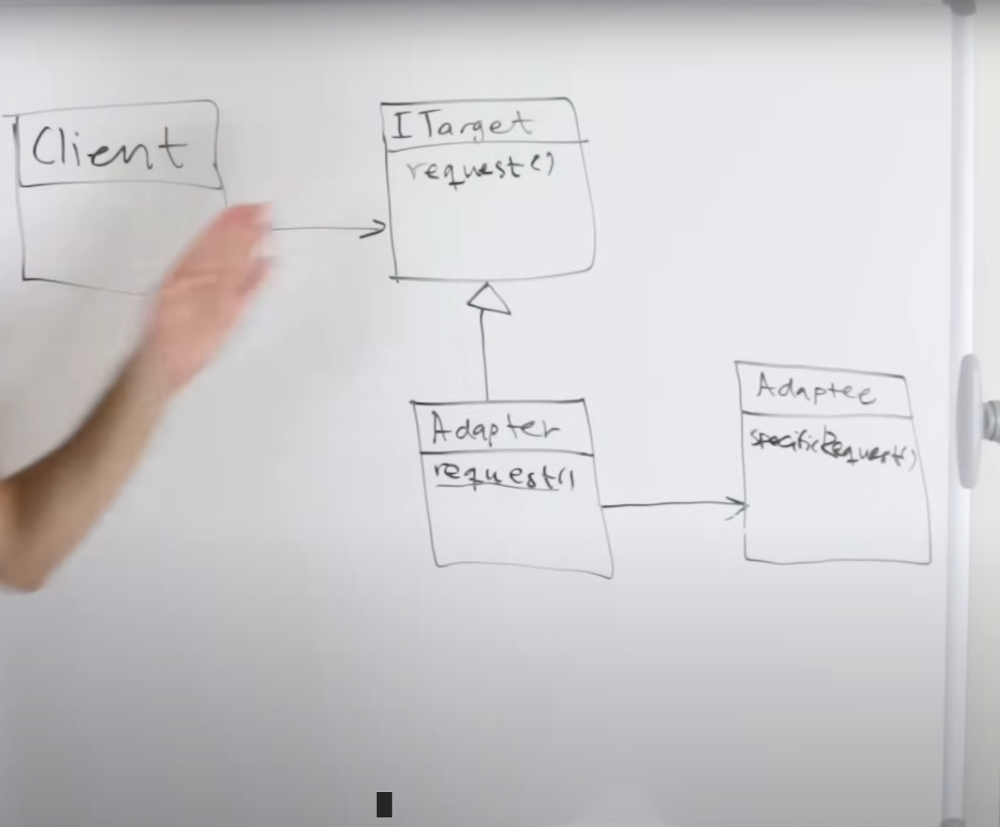
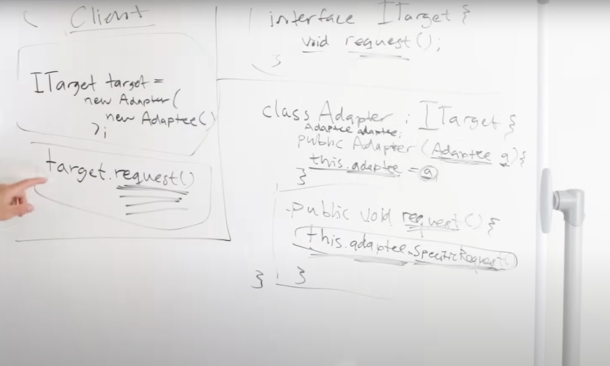
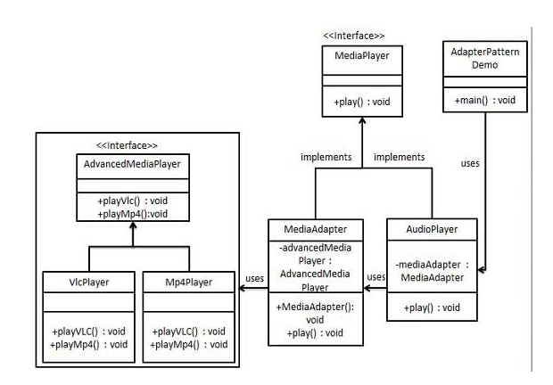
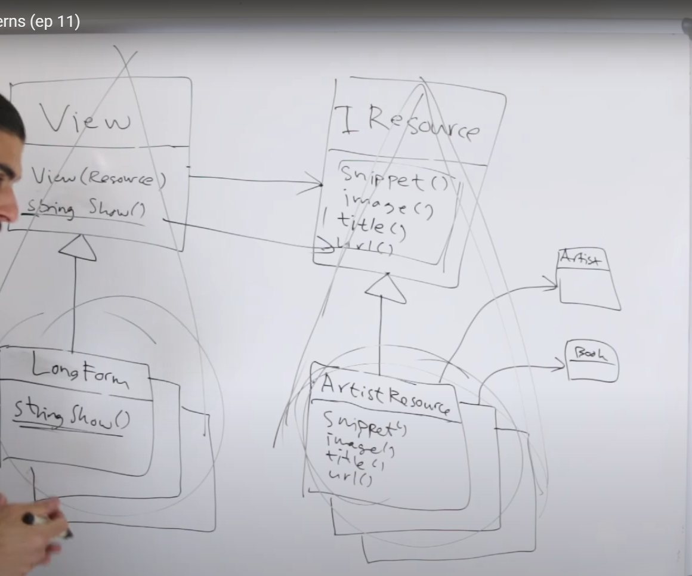
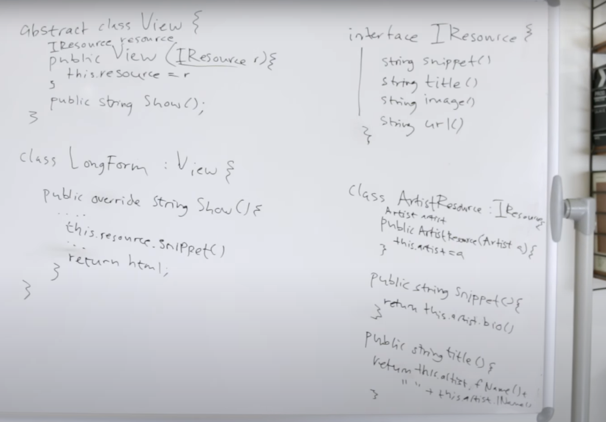
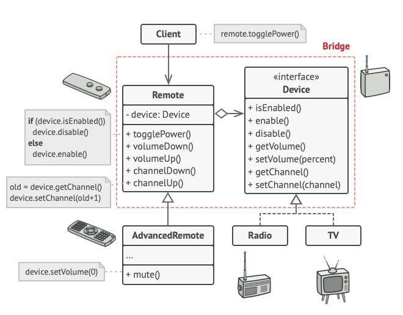

**Factory Pattern** 

Factory Method is a creational design pattern that provides an interface for creating objects in a superclass, but allows subclasses to alter the type of objects that will be created

**Abstract Factory Pattern**

Abstract Factory is a creational design pattern that lets you produce families of related objects without specifying their concrete classes

Use the Abstract Factory when your code needs to work with various families of related products, but you don’t want it to depend on the concrete classes of those products—they might be unknown beforehand or you simply want to allow for future extensibility

**Prototype Pattern**

https://www.baeldung.com/wp-content/uploads/2019/10/Prototype-Pattern.png

The Prototype pattern is generally used when we have an instance of the class (prototype) and we’d like to create new objects by just copying the prototype

**Singleton pattern**

Singleton is a creational design pattern that lets you ensure that a class has only one instance, while providing a global access point to this instance.
Why would anyone want to control how many instances a class has? The most common reason for this is to control access to some shared resource—for example, a database or a file

**Structural**

**Adapter Design Pattern**

Client : The object which wants to call a method provided by the library

ITarget : A interface that is implemented by both the client and the adpater

Adapter : The object that is actually responsible for making the call from client to the library

Adaptee : The library ( i.e the class which we can not modify)

For our example, the adapters

AudioPlayer - Client
MediaPlayer - Common interface between client and adaptter
MediaAdapter - The adapter that allows us to call the adaptee's method
VLCPlayer - The library

Bridge pattern

Helps us seperate platform specific(types of IREsources) from platform independent(views)

View - Abstraction1 ( has abstraction2)
LongFormView - Concrete implemention of Abstraction1
IResource - Abstraction2
ArtistResource - Concrete implementation of Abstraction2

Example 2 :

In the above, we can have multiple types of remotes, i.e advanced remote, firestick, old remote etc. 
We can have multiple types of devices, i.e TV, radio, alexa etc. 

The goal of bridge pattern is to make work a multiple combination of objects withount needing
to create a seperate class for each combination. 